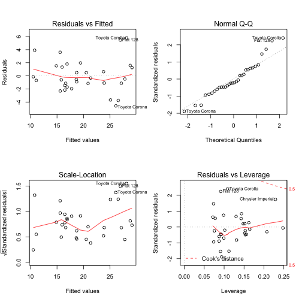

Linear Model Explorer for mtcars Dataset
========================================================
author: Melvin Yap

Introduction
========================================================

The Linear Model Explorer for **mtcars** dataset enables
an analyst to do the following:

- Identify a fit to a linear model
- Examining a fit

Identifying a Fit
========================================================

The application facilitates identification and selection
from a list of variables to be fitted to a linear model in
an intuitive way.

The following is the data preparation for the user interface.


```r
data(mtcars)

mtcars$cyl <- factor(mtcars$cyl)
mtcars$vs <- factor(mtcars$vs)
levels(mtcars$vs) <- c("V Engine", "Straight Engine")
mtcars$am <- factor(mtcars$am)
levels(mtcars$am) <- c("Automatic", "Manual")
mtcars$gear <- factor(mtcars$gear)
```

Examining a Fit Part 1
========================================================

<b>Interpreting Residuals vs Fitted Values</b>

To determine whether a linear model is appropriate for
a set of variables, the application displays 4 standard
plots for analysis.
***
 

Examining a Fit Part 2
========================================================

<b>Summary and ANOVA</b>

Based on the selection of variables in the application, 
analyst can analyse by summary of model or ANOVA.

Their results are displayed in separate tabs in the
application.

Conclusion
========================================================

The linear model explorer shiny app is useful in helping 
the analyst zoom in on the relevant predictor variables
as a preview before deep diving into proper model building.
